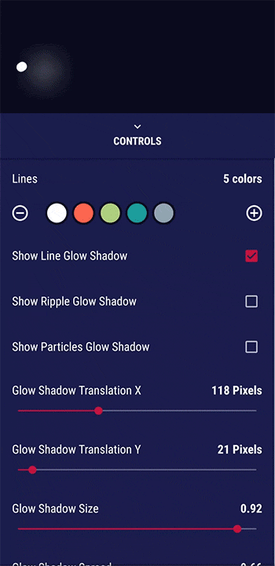
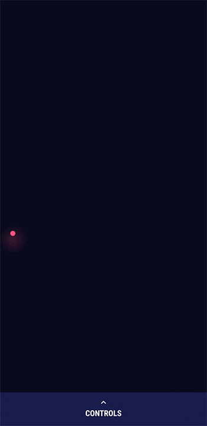

# SuperGlowingLoader &nbsp; 


A completely customisable and beautiful indeterminate Progress View for Android. Inspired by Loader Challenge on Uplabs. Play with its numerous controls and amuse your users while they wait for something good :)

[](https://www.android.com)
[](https://www.apache.org/licenses/LICENSE-2.0.html)

**[DOWNLOAD DEMO APK](assets/Super%20GLowing%20Loader%20Demo.apk)**


</br>
</br>

#### The library lets you control almost every aspect of the loader animation. I've designed the demo app to let others play with all the customizations possible in the animation  


 &nbsp; 


## Usage

1. I am working on making the library avaible via jitpack. Should be done in a day or so. Currently you'll have to download the repository as zip or clone it via git. After that import the library module to your project. 

2. After successfully setting the `loader-library` module as dependency for your main app module, Just use `com.glennio.glowingloaderlib.GlowingLoaderView` as any other progress view in your layout.

For a complete implemantation and various customization, explore the [GlowingLoaderView.java](loader-library/src/main/java/com/glennio/glowingloaderlib/GlowingLoaderView.java) class.

```java
// you can customise the loader useing following setters (Customisation via attributes is a work in progress)

    //LineSpec obecct let you sepecify properties of lines in the animation
    //minLength;
    //maxLength;
    //color;
    //startDelay;
    //Interpolator interpolator;
    void setLineSpecs(LineSpec[] lineSpecs) 
  
    void setShowLineGlowShadow(boolean showLineGlowShadow)

    void setShowRippleGlowShadow(boolean showRippleGlowShadow)

    void setShowParticleGlowShadow(boolean showParticleGlowShadow)

    void setGlowShadowDy(float glowShadowDy)

    void setGlowShadowDx(float glowShadowDx) 

    void setGlowShadowSize(float glowShadowSize) 

    void setGlowShadowSpread(float glowShadowSpread)

    void setGlowShadowAlpha(float glowShadowAlpha)
    
    void setDuration(long duration) 

    setAspectRatio(float aspectRatio)

    setLineStrokeWidth(float lineStrokeWidth)

    void setParticleColors(int[] particleColors)
    
    void setRippleColor(int rippleColor) 

    void setParticlesAlphaMinMax(float min, float max) 

    void setParticleSizeMinMax(float min, float max)

    void setParticleCountMinMax(int min, int max)

    void setRippleAlpha(float rippleAlpha) 

    void setRippleStrokeMinMax(float min, float max)

    void setRippleSizeMinMax(float min, float max) 

    void setRippleDuration(long rippleDuration)

    void setParticleTranslationMinMax(float min, float max)

    void setParticleRotationMinMax(float min, float max)
    
    // suports squares,circles and triangles
    void setParticleTypes(int[] particleTypes) 
    
    
```

## Apps that use this library

If you're using this library in your app and you'd like to list it here,  
please let me know via [email](mailto:denhelp1@gmail.com) or [pull requests](https://github.com/surahul/SuperGlowingLoader/pulls) or [issues](https://github.com/surahul/SuperGlowingLoader/issues).


## Contributions

Help me make this library better by contributing to the code. Any contributions are welcome!  


## Developed By

* [Rahul Verma](https://www.facebook.com/iamsurahul) - [denhelp1@gmail.com](mailto:rv@videoder.com)


## Thanks
