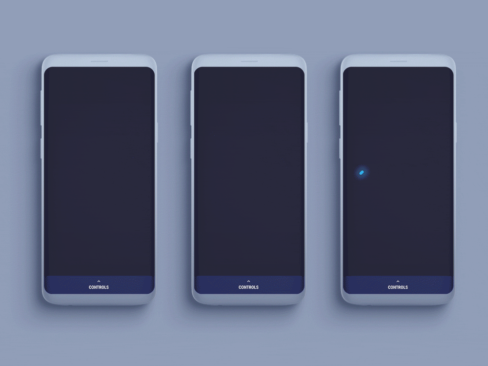
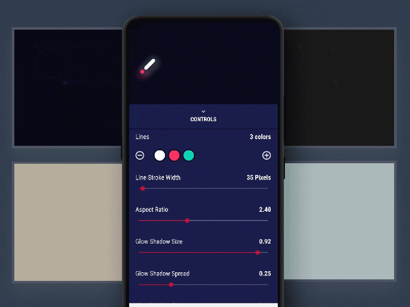

<h1>    &nbsp; SuperGlowingLoader</h1>

[](https://www.android.com)
[](https://www.apache.org/licenses/LICENSE-2.0.html)


<p style="color:#323232; font-size:18px">A completely customisable and beautiful indeterminate Progress View for Android. With over 30 parameters that can be changed, this loader can be modified to be unique and match your app's theme 🤘</p>


<br>



<br>


<h1>Demo App</h1>


<p style="color:#424242; font-size:16px;">The demo app has an inbuilt control pannel. It lets you edit every parameter of the animation from within the demo. Its much more easier than seeing the change via changin code and running the demo. Try it and you'll find how easy and fast it is to design your own version.</p>


[](https://play.google.com/store/apps/details?id=com.glennio.theglowingloader)
<br>
<br>

<center>
    

    
</center>

<br>


<h1>Usage</h1>

- <span style="color:#111111; font-size:16px;"> Add `implementation 'com.surahul:superglowingloader:1.0.0'` to your `dependencies` in `build.gradle` file of your app module.
</span>
- <span style="color:#111111; font-size:16px;">Just use `com.glennio.glowingloaderlib.GlowingLoaderView` as any other progress view in your layout.</span>

<br>
<span style="color:#222222; font-size:16px;">
For a complete implemantation and various customization, explore the [GlowingLoaderView.java](loader-library/src/main/java/com/glennio/glowingloaderlib/GlowingLoaderView.java) class.</span>
<br>

```java
// you can customise the loader useing following setters (Customisation via attributes is a work in progress)

    //LineSpec object let you sepecify properties of lines in the animation
    //minLength;
    //maxLength;
    //color;
    //startDelay;
    //Interpolator interpolator;
    void setLineSpecs(LineSpec[] lineSpecs) 
  
    void setShowLineGlowShadow(boolean showLineGlowShadow)

    void setShowRippleGlowShadow(boolean showRippleGlowShadow)

    void setShowParticleGlowShadow(boolean showParticleGlowShadow)

    void setGlowShadowDy(float glowShadowDy)

    void setGlowShadowDx(float glowShadowDx) 

    void setGlowShadowSize(float glowShadowSize) 

    void setGlowShadowSpread(float glowShadowSpread)

    void setGlowShadowAlpha(float glowShadowAlpha)
    
    void setDuration(long duration) 

    void setAspectRatio(float aspectRatio)

    void setLineStrokeWidth(float lineStrokeWidth)

    void setParticleColors(int[] particleColors)
    
    void setRippleColor(int rippleColor) 

    void setParticlesAlphaMinMax(float min, float max) 

    void setParticleSizeMinMax(float min, float max)

    void setParticleCountMinMax(int min, int max)

    void setRippleAlpha(float rippleAlpha) 

    void setRippleStrokeMinMax(float min, float max)

    void setRippleSizeMinMax(float min, float max) 

    void setRippleDuration(long rippleDuration)

    void setParticleTranslationMinMax(float min, float max)

    void setParticleRotationMinMax(float min, float max)
    
    // suports squares,circles and triangles
    void setParticleTypes(int[] particleTypes) 
    
    
```


<h1>Apps that use this library</h1>

If you're using this library in your app and you'd like to list it here,  
please let me know via [email](mailto:denhelp1@gmail.com) or [pull requests](https://github.com/surahul/SuperGlowingLoader/pulls) or [issues](https://github.com/surahul/SuperGlowingLoader/issues).


<h1>Contributions</h1>

Help me make this library better by contributing to the code. Any contributions are welcome!  


<h1>Developed By</h1>

* [Rahul Verma](https://www.facebook.com/iamsurahul) - [denhelp1@gmail.com](mailto:rv@videoder.com)


<h1>Thanks</h1>

